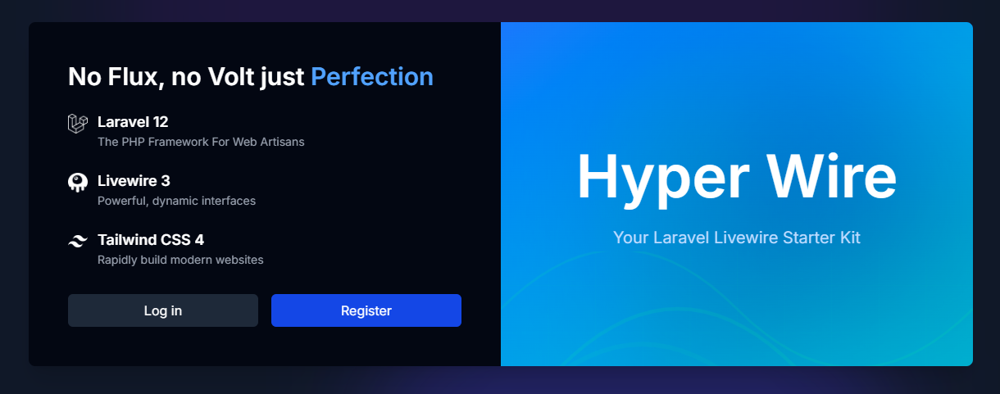
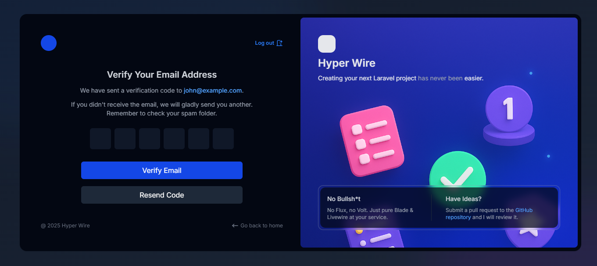

# Hyper Wire Starter Kit
[](https://packagist.org/packages/yehuuu6/hyperwire)
[](https://www.repostatus.org/#active)

<a href="https://herd.laravel.com/new?starter-kit=yehuuu6/hyperwire"></a><br>

A clean Laravel Livewire starter kit without Flux or Volt and code mess!



## Features

- **No Flux or Volt:** Enjoy a streamlined development experience without the added complexity of Flux or Volt.
- **Minimal Boilerplate:** Focus on your application's core logic with minimal, easy-to-understand boilerplate code and components.
- **Email OTP Verification:** Enhanced security with Email OTP (One-Time Password) verification instead of traditional link-based verification.

- **Rate Limiter:** Limit user actions using the [Livewire Rate Limiter](https://github.com/yehuuu6/livewire-rate-limiting) package.
- **Toast Notifications:** Beautiful toast notifications thanks to the [Livewire Toaster](https://github.com/masmerise/livewire-toaster) package.


## Installation

You can use the [Laravel Installer](https://laravel.com/docs#installing-php) to install Hyper Wire starter kit.

```bash
laravel new my-app --using=yehuuu6/hyperwire
cd my-app
```

Then, run `composer run dev` to run the development server & queues and other tools, then build your project!

## Built With

Below is a list of all the technologies this starter kit has been **built with**:

- [Laravel 12](https://laravel.com)
- [Livewire 3](https://livewire.laravel.com)
- [TailwindCSS 4](https://tailwindcss.com)

## License

The MIT License (MIT). Please see [License File](https://github.com/yehuuu6/hyperwire/blob/main/LICENSE) for more information.